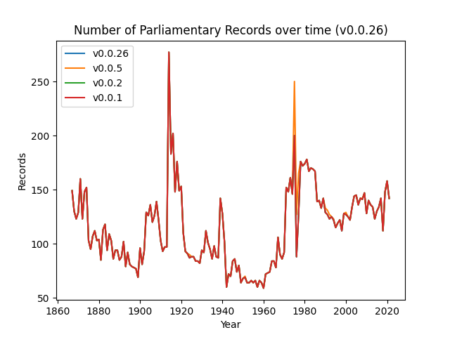
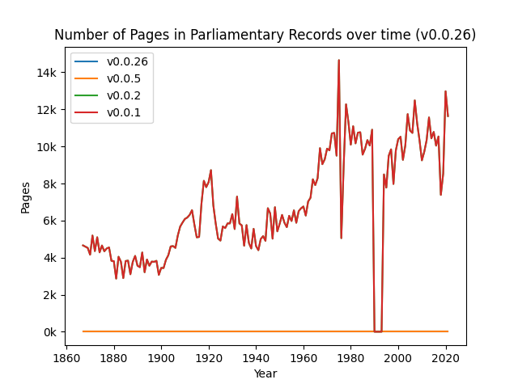
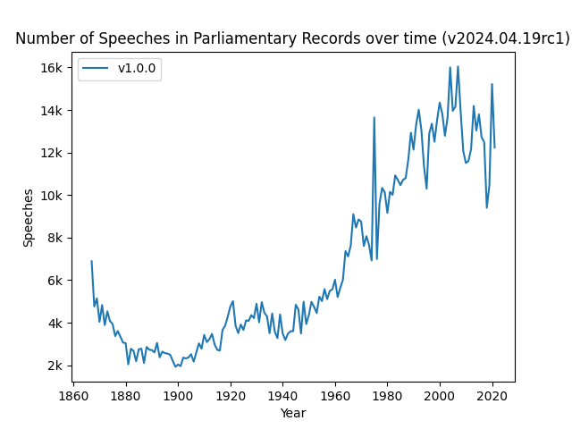
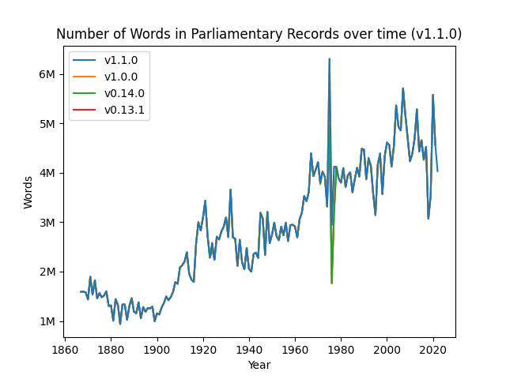
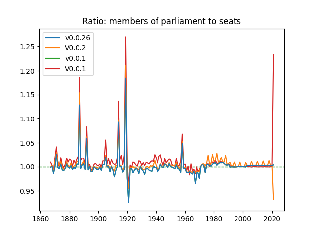
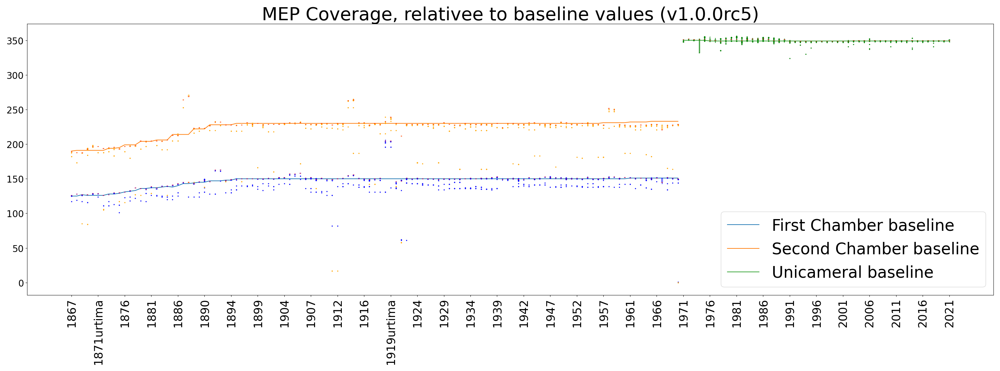

[](https://github.com/swerik-project/riksdagen-records/actions/workflows/push.yml)
[](https://github.com/swerik-project/riksdagen-records/actions/workflows/validate.yml)


# Swedish parliamentary proceedings --- 1867--today --- v2024.04.26

_Westac Project_, 2020--2024 |
_Swerik Project_, 2023--2025


## The data set

The full data set consists of multiple parts, which are version controlled independently from eachother. For convenience, the most up-to-date versions of these data sets are zipped and made available as a package on [the release page](https://github.com/swerik-project/the-swedish-parliament-corpus/releases) any time there's an update. These components are:

- ```records_vX.X.X.zip``` -- Parliamentary records (riksdagens protokoll) from 1867 until today in the [Parla-clarin](https://github.com/clarin-eric/parla-clarin) format
- ```persons_vX.X.X.zip``` -- Comprehensive list of members of parliament, ministers and governments during this period + associated metadata (mandate periods, party info, etc)
- ```dumps_v20XX.XX.XX.zip``` -- various files containing merged / filtered / wrangled (meta)data
- [comming soon] -- An annotated catalog of motions submitted to the parliament with linked metadata
- [comming soon] -- An annotated catalog of Interpellation questions submitted to the government and Interpellation debates within the parliament


### Version compatibility

The table below is a record of semantically versioned repositories that are known to be compatible a the time of dated releases here:

| Dated Release|                               Repository Versions                              |
|--------------|--------------------------------------------------------------------------------|
|  v2024.04.26 |  pyriksdagen: v1.2.0<br>riksdagen-persons: v1.0.0<br>riksdagen-records: v1.0.0 |

## Basic use

Get the most recent version of the data can be found [here](https://github.com/swerik-project/the-swedish-parliament-corpus/releases/). It has the following structure

- Annual Parliamentary record (protocol) files organized in subdirectories according to parliament years
- Structured metadata on members of parliament, ministers, and governments

Archives (```.zip``` files) can be downloaded, extracted, and used in whatever way. We offer some examples and tools for working with the corpus in Python and R.


### Pyriksdagen: a Python module

[Pyriksdagen](https://github.com/swerik-project/pyriksdagen) is a Python module developed in parallel with the corpus, designed spedifically for working with the corpus. It can be installed via [PyPi](https://pypi.org/project/pyriksdagen/) in the ordinary way

   (venv) ~$  pip install pyriksdagen

A simple workflow is demonstrated in [this Google Colab notebook](https://colab.research.google.com/github/swerik-project/pyriksdagen/blob/main/examples/corpus-walkthrough.ipynb).

### rcr: an R module

There's an R package; to install, run:

```
library(remotes)
remotes::install_github('swerik-project/rcr')
```

As a first step, we point to the directory where the corpus files are stored.

	set_riksdag_corpora_path("[THE PATH TO THE CORPORA HERE]")

To extract speeches, we use ```extract_speeches_from_records()```. Below is an example that assumes that the corpora path has been set and extracts the speeches from three different records.

```
fps <-
  c("protocols/1896/prot-1896--ak--042.xml",
    "protocols/1951/prot-1951--fk--029.xml",
    "protocols/1975/prot-1975--036.xml")
sp <- extract_speeches_from_records(fps)
```

## Design choices of the project

The Riksdagen corpus is released as an iterative process, where the corpus is continuously curated and expanded. Semantic versioning is used for the whole corpus, following the established major-minor-patch practices as they apply to data. For each major and minor release, a battery of unit tests are run and a statistical sample is drawn, annotated and quantitatively evaluated to ensure integrety and quality of updated data. Errors are fixed as they are detected in order of priority. Moreover, the edit history is kept as a traceable git repository.

While the contents of the corpus will change due to curation and expansion, we aim to keep the deliverable API, the `corpus/` folder, as stable as possible. This means we avoid relocating files or folders, changing formats, changing columns in metadata files, or any other changes that might break downstream scripts. Conversely, files outside the `corpus/` folder are internal to the project. End users may find utility in them but we make no effort to keep them consistent.

The data in the corpus is delivered as TEI XML files to follow established practices. The metadata is delivered as CSV files, following a [normal form](https://en.wikipedia.org/wiki/Database_normalization) database structure while allowing for a legible git history. A more detailed description of the data and metadata structure and formats can be found in the README files in the `corpus/` folder.

## Documentation

Documentation and example usage of Pyriksdagen and rcr can be found in their respective repositories. Additionally some documentation about the curation process can be found in the [scripts repository](https://github.com/swerik-project/scripts).

## Descriptive statistics at a glance

Currently, we have an extensive set of Parliamentary Records (Riksdagens Protokoll) from 1867 until now. We are in the process of preparing Motions for inclusion in the corpus and other document types will follow.

|                                      | v2024.04.26|   v0.14.0  |   v0.13.1  |
|--------------------------------------|------------|------------|------------|
|           Corpus size (GB)           |    11.06   |    5.48    |    5.48    |
|    Number of parliamentary records   |    17800   |    17642   |    17642   |
|   Total parliamentary record pages*  |   1056361  |   1045458  |   1045458  |
|  Total parliamentary record speeches |   1022014  |   1014214  |   1014214  |
|   Total parliamentary record words   |  446349968 |  442634322 |  442634322 |
|           Number of Motions          |      0     |      0     |      0     |
|          Total motion pages          |      0     |      0     |      0     |
|          Total motion words          |      0     |      0     |      0     |
|     Number of people with MP role    |    5975    |    5975    |    5975    |
|  Number of people with minister role |     546    |     546    |     546    |

\* Digital original parliamentary records for some years in the 1990s are not paginated and thus do not contribute to the page count.See also §_Number of Pages in Parliamentary Records_.

### Parliamentary Records over time

This section plots information about the parliamentary records from the ```riksdagen-records``` repository v1.0.0.

#### Number of Parliamentary Records



#### Number of Pages in Parliamentary Records



#### Number of Speeches in Parliamentary Records



#### Number of Words in Parliamentary Records




## Quality assessment

### Speech-to-speaker mapping

We check how many speakers in the parliamentary records our algorithms idenify in each release. From the ```riksdagen-records``` repository v1.0.0.


### Correct number of MPs over time

We check the number of MPs with a mandate on a given day against he baseline number of MPs that we know _should be_ sitting in parliament. From the riksdagen-persons repository v1.0.0.

This plot illustrates the mean daily number of MPs in the metadata compared to the baseling.



For more granularity, the plot below shows a box plot distribution of the daily number of MPs in each year agaist the baseline; mostly they are not visible, as they are tightly underneath the mean line (red). Colored dots represent outlier days.



### Segment classification

The parliamentary records are subdivided into various components, including utterances, notes, and speaker introductions. As of the ```riksdagen-records``` repository v1.0.0, the segment classification accuracy was 0.9499. 

### OCR accuracy

As of v1.0.0 of the ```riksdagen-records``` corpus, the cumulative character error rate for 0.0311, and the word error rate is 0.0869, i.e., roughly 3 per cent of the characters and 9 per cent of the words are incorrect due to OCR errors.


## Participate!

If you would like to participate in the curation or quality control of data contained in the Swedish Parliament Corpus, please [be in touch](https://github.com/orgs/swerik-project/discussions)!

## Acknowledgement of support

- Westac funding: Vetenskapsrådet 2018-0606

- Swerik funding:Riksbankens Jubileumsfond IN22-0003


---
Last update: 2024-04-26, 10:11:47
