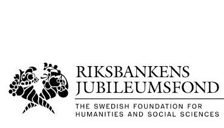

# The Swedish Parliament Corpus --- 1867--today --- v2025.05.20

_Westac Project_, 2020--2024 |
_Swerik Project_, 2023--2025

The Swedish Parliament Corpus is actually a collection of corpora storing various document types and metadata related to proceedings of the Swedish Riksdag. Documents are structured and annotated in accordance with established practice in parliamentary corpus construction -- [TEI](https://www.tei-c.org/) and [ParlaClarin](https://github.com/clarin-eric/parla-clarin). Metadata about actors and organizations involved in parliamentary business is stored in Normal Forms and linked across Swerik data sets and beyond...


## Design choices of the project

The Swedish parlamentary corpora are developed and released iteratively, where the quality improvements and data are added and evaluated continuously. Semantic versioning is used for the whole corpus, following the established major-minor-patch practices as they apply to data. For each release, a battery of unit tests are run and a statistical sample is drawn, annotated and quantitatively evaluated to ensure integrity and quality of updated data. Errors are fixed as they are detected in order of priority. Moreover, the edit history is kept as a traceable git repository.

While the contents of these corpora will change due to qualitative improvements, curation and expansion, we aim to keep the deliverable API, i.e. the `data/` folders, as stable as possible. This means we avoid changing existing folder structures, changing file names, changing formats, changing columns and column names in metadata files, or any other changes that might break downstream scripts. 

Please consult [Yrjänäinen et al. (2024)](https://aclanthology.org/2024.lrec-main.1400.pdf) for an in-depth description of this project's design principles.


## The data set

The full data set consists of multiple parts, which are version controlled independently from each other. For convenience, the most up-to-date versions of these data sets are zipped and made available as a package on [the release page](https://github.com/swerik-project/the-swedish-parliament-corpus/releases) roughly once a month. These components are:


### The Riksdagen Records Corpus -- latest v1.4.2

[](https://github.com/swerik-project/riksdagen-records/actions/workflows/push.yml)
[](https://github.com/swerik-project/riksdagen-records/actions/workflows/validate.yml)

This is a collection of structured, annotated records from meetings of the Swedish Riksdag. The records are encoded in [ParlaClarin](https://github.com/clarin-eric/parla-clarin)-compliant xml.
The release contains:

- ```records.zip``` -- the parliamentary records 
- ```quality.zip``` -- various calculations and estimates relating to the quality of the released data
- ```Source code``` -- a zipped / tar balled snap shot of the repository

View the Riksdagen Records Repository [here](https://github.com/swerik-project/riksdagen-records) or the complete most recent release [here](https://github.com/swerik-project/riksdagen-records/releases/latest).


### The Riksdagen Persons Corpus -- latest v1.2.0

[](https://github.com/swerik-project/riksdagen-persons/actions/workflows/push.yml)

This is a comprehensive collection of members of parliament, ministers and governments during this period & associated metadata (mandate periods, party info, etc).

- ```persons.zip``` --  metadata tables
- ```dumps.zip``` -- various files containing merged / filtered / wrangled (meta)data
- ```quality.zip``` -- various calculations and estimates relating to the quality of the released data
- ```Source code``` -- a zipped / tar balled snap shot of the repository

View the Riksdagen Persons Repository [here](https://github.com/swerik-project/riksdagen-persons) or the complete most recent release [here](https://github.com/swerik-project/riksdagen-persons/releases/latest).


### The Riksdagen Motions Corpus -- latest v0.3.1

This is a collection of structured, annotated motions submitted to the Swedish Riksdag with linked metadata. The motions are encoded in [TEI](https://www.tei-c.org/)-compliant XML.

- ```motions.zip``` -- the motions 
- ```quality.zip``` -- various calculations and estimates relating to the quality of the released data
- ```Source code``` -- a zipped / tar balled snap shot of the repository

View the Riksdagen Motions Repository [here](https://github.com/swerik-project/riksdagen-motions) or the complete most recent release [here](https://github.com/swerik-project/riksdagen-motions/releases/latest).


### The Riksdagen Interpellations Corpus -- latest v0.2.2

From the 1994/95 parliament year, written Interpellation questions submitted to members of the government are stored as a separate class of documents. This is a structured, annotated catalog of these Interpellation questions, encoded in [TEI](https://www.tei-c.org/)-compliant XML. Earlier interpellation questions, as well as interpellation debates in general can be found in the Riksdagen Records.

- ```interpellation-questions.zip``` -- the interpellations 
- ```quality.zip``` -- various calculations and estimates relating to the quality of the released data
- ```Source code``` -- a zipped / tar balled snap shot of the repository

View the Riksdagen Interpellations Repository [here](https://github.com/swerik-project/riksdagen-interpellatoins) or the complete most recent release [here](https://github.com/swerik-project/riksdagen-interpellations/releases/latest).


## Working with the data

We offer some Python and R-based tools for working with the data. While users are free to work with the data in any way they see fit, we recommend utilizing tried and tested functions, particularly the Pyriksdagen Python module.


### Pyriksdagen -- latest v1.8.1

[](https://github.com/swerik-project/pyriksdagen/actions/workflows/push.yml)

[Pyriksdagen](https://github.com/swerik-project/pyriksdagen) is a Python module developed in parallel with the corpus, designed spedifically for working with the corpus. It can be installed via [PyPi](https://pypi.org/project/pyriksdagen/) in the ordinary way

   ```(venv) ~$  pip install pyriksdagen```

A simple workflow is demonstrated in [this Google Colab notebook](https://colab.research.google.com/github/swerik-project/pyriksdagen/blob/main/examples/corpus-walkthrough.ipynb).

Each release of Pyriksdagen is published immediately on PyPi, nevertheless, each release is also zipped/tarballed on the releases page for manual installation.

View the Pyriksdagen Interpellations Repository [here](https://github.com/swerik-project/pyriksdagen) or the complete most recent release [here](https://github.com/swerik-project/pyriksdagen/releases/latest).


### The "scripts" Repository -- latest v0.0.5

The scripts repository contains (primarily) Python scripts that we use for curation and maintenance of the data sets. Although we have begun releasing versions of this repository, we make no promise of backwards compatibility, rather we offer this code as a set of examples that users may find helpful.

View the scripts repository [here](https://github.com/swerik-project/scripts).


### rcr -- latest v0.3.0

There is also an R package under development; to install, run:

```
library(remotes)
remotes::install_github('swerik-project/rcr')
```

As a first step, we point to the directory where the corpus files are stored.

	set_riksdag_corpora_path("[THE PATH TO THE CORPORA HERE]")

To extract speeches, we use ```extract_speeches_from_records()```. Below is an example that assumes that the corpora path has been set and extracts the speeches from three different records.

```
fps <-
  c("protocols/1896/prot-1896--ak--042.xml",
    "protocols/1951/prot-1951--fk--029.xml",
    "protocols/1975/prot-1975--036.xml")
sp <- extract_speeches_from_records(fps)
```

View the rcr repository [here](https://github.com/swerik-project/rcr) or the complete most recent release [here](https://github.com/swerik-project/rcr/releases/latest).

## Version compatibility and Release Schedule

From 2025, we aim to make new releases of all repositories around the middle of each month (assuming there is new work to release). In theory, these "dated" releases of various repositories should be compatible with others released around the same time. The table below is a record of semantically versioned repositories at the time of scheduled releases:

| Dated Release|                                                                                     Repository Versions                                                                                    |
|--------------|--------------------------------------------------------------------------------------------------------------------------------------------------------------------------------------------|
|  v2025.05.20 |  pyriksdagen: v1.8.1<br>riksdagen-persons: v1.2.0<br>riksdagen-records: v1.4.2<br>riksdagen-motions: v0.3.1<br>riksdagen-interpellations: v0.2.2<br>scripts: v0.0.5<br>rcr-version: v0.3.0 |
|  v2025.04.16 |  pyriksdagen: v1.8.1<br>riksdagen-persons: v1.1.3<br>riksdagen-records: v1.4.2<br>riksdagen-motions: v0.3.0<br>riksdagen-interpellations: v0.2.2<br>scripts: v0.0.4<br>rcr-version: v0.3.0 |
|  v2025.04.10 |  pyriksdagen: v1.8.0<br>riksdagen-persons: v1.1.3<br>riksdagen-records: v1.4.1<br>riksdagen-motions: v0.3.0<br>riksdagen-interpellations: v0.2.1<br>scripts: v0.0.3<br>rcr-version: v0.3.0 |
|  v2025.03.24 |  pyriksdagen: v1.8.0<br>riksdagen-persons: v1.1.2<br>riksdagen-records: v1.4.1<br>riksdagen-motions: v0.3.0<br>riksdagen-interpellations: v0.2.1<br>scripts: v0.0.3<br>rcr-version: v0.3.0 |
|  v2025.02.14 |  pyriksdagen: v1.8.0<br>riksdagen-persons: v1.1.2<br>riksdagen-records: v1.4.0<br>riksdagen-motions: v0.2.2<br>riksdagen-interpellations: v0.2.1<br>scripts: v0.0.2<br>rcr-version: v0.3.0 |
|  v2025.01.15 |  pyriksdagen: v1.7.1<br>riksdagen-persons: v1.1.1<br>riksdagen-records: v1.3.0<br>riksdagen-motions: v0.2.1<br>riksdagen-interpellations: v0.2.0<br>scripts: v0.0.1<br>rcr-version: v0.3.0 |
|  v2024.09.13 |                                                        pyriksdagen: v1.4.0<br>riksdagen-persons: v1.1.0<br>riksdagen-records: v1.2.0                                                       |
|  v2024.06.19 |                                                        pyriksdagen: v1.2.0<br>riksdagen-persons: v1.1.0<br>riksdagen-records: v1.1.0                                                       |
|  v2024.04.26 |                                                        pyriksdagen: v1.2.0<br>riksdagen-persons: v1.0.0<br>riksdagen-records: v1.0.0                                                       |


## Documentation

For repositories that include documentation, including those data repositories described above, the documentation can be read at `swerik-project.github.io/\<repo-name>`; e.g. [https://swerik-project.github.io/pyriksdagen](https://swerik-project.github.io/pyriksdagen) for the Pyriksdagen module or [https://swerik-project.github.io/riksdagen-records](https://swerik-project.github.io/riksdagen-records) for the Riksdagen Records repository.


## Corpora Quality at a glance

We are developing and implementing an extensive battery of quality assessments and data integrity tests for each corpus. Some example results are presented in plot form below, but full results of these evaluations can be found in the respective repository's `quality/` and `test/` directories. We are working continuously to present these results in a more accessible way.


### Speech-to-speaker mapping

We check how many speakers in the parliamentary records our algorithms idenify in each release. From the ```riksdagen-records``` repository v1.4.2.


### Correct number of MPs over time

We check the number of MPs with a mandate on a given day against he baseline number of MPs that we know _should be_ sitting in parliament. From the riksdagen-persons repository v1.2.0.

This plot illustrates the mean daily number of MPs in the metadata compared to the baseling.


For more granularity, the plot below shows a box plot distribution of the daily number of MPs in each year agaist the baseline; mostly they are not visible, as they are tightly underneath the mean line (red). Colored dots represent outlier days.


## Participate!

If you would like to participate in the curation or quality control of data contained in the Swedish Parliament Corpus, please [be in touch](https://github.com/orgs/swerik-project/discussions)!

## Acknowledgement of support

- Westac funding: Vetenskapsrådet 2018-0606

- Swerik funding:Riksbankens Jubileumsfond IN22-0003




---
Last update: 2025-05-20, 19:21:50
